# AUTOMATE INFRASTRUCTURE WITH IAC USING TERRAFORM PART 2

## Table of Contents
- [Introduction](#introduction)
- [Prerequisites](#prerequisites)
- [Networking](#networking)
    - [Creating our Private Subnets](#creating-our-private-subnets)
    - [Introducing Tagging](#introducing-tagging)
    - [Creating our Internet Gateway](#creating-our-internet-gateway)
    - [Creating our NAT Gateway](#creating-our-nat-gateway)
    - [AWS Routes](#aws-routes) 
        - [Creating Private routes](#creating-private-routes)
        - [Creating Public routes](#creating-public-routes)
- [AWS Identity and Access Management](#aws-identity-and-access-management)
    - [Creating an IAM Role (AssumeRole)](#creating-an-iam-role-assumerole)
    - [Creating an IAM Policy](#creating-an-iam-policy)


## Introduction
This is the second part of the series on Infrastructure as Code using Terraform. In this part, we will be creating a VPC, Subnets, Internet Gateway, NAT gateway, Route Table, AutoScaling group, RDS, Security Group and EC2 instance. We will also be using the outputs from the previous part to create the VPC and Subnets.
To get up to speed with the previous part, you can read it [here](https://github.com/manny-uncharted/project-16)

Note: We are building according to this architecture


## Prerequisites
- [Terraform](https://www.terraform.io/downloads.html)
- [AWS Account](https://aws.amazon.com/)
- [AWS CLI](https://docs.aws.amazon.com/cli/latest/userguide/cli-chap-install.html)


## Networking
As a continuation to our previous part we would get started by

- Initializing Terraform
    ```bash
    terraform init
    ```

    result
    

### Creating our Private Subnets
We would need to create 4 private subnets in our VPC. 
- In the `main.tf` file, we would create a resource for the private subnets
```terraform
resource "aws_subnet" "private" {
  count                   = var.preferred_number_of_private_subnets == null ? length(data.aws_availability_zones.available.names) : var.preferred_number_of_public_subnets
  vpc_id                  = aws_vpc.main.id
  cidr_block              = cidrsubnet(var.vpc_cidr, 8, count.index + 2)
  map_public_ip_on_launch = true
  availability_zone       = data.aws_availability_zones.available.names[count.index]
}
```
- In our `variables.tf` file, we would add the following variables
```terraform
variable "preferred_number_of_private_subnets" {
  # default = 4
  type        = number
  description = "Number of private subnets to create. If not specified, all available AZs will be used."
}
```

- In our 'terraform.tfvars' file, we would add the following
```terraform
preferred_number_of_private_subnets = 4
```

- We would then run `terraform plan` to see the changes that would be made
```bash
terraform plan
```

result:


### Introducing Tagging
We would need to tag our resources to make it easier to identify them. 

- We would need to add the following to our `main.tf` file to the public and private subnets
```terraform
tags = merge(
    var.tags,
    {
      Name = format("%s-Private-subnet-%s", var.name, count.index + 1)
    },
)
```

- In our `variables.tf` file, we would add the following variables
```terraform
variable "tags" {
  type        = map(string)
  description = "A map of tags to add to all resources."
  default     = {}
}
```

Note: The `merge` function is used to merge two maps together. In this case, we are merging the `var.tags` and the `Name` tag. The `var.tags` is a map of tags that we would pass in as a variable. The `Name` tag is the name of the subnet. The 'format' function is used to format the string. In this case, we are formatting the string to include our defined name, the type of subnet and the index of the subnet.

result:


- Let's run 'terraform plan' to see the changes that would be made
```bash
terraform plan
```

result:


### Creating our Internet Gateway
We would need to create an internet gateway to allow our instances to access the internet.
- Create an internet gateway in a separate file called `internet_gateway.tf`
```terraform
resource "aws_internet_gateway" "ig" {
  vpc_id = aws_vpc.main.id

  tags = merge(
    var.tags,
    {
      Name = format("%s-Internet-Gateway", aws_vpc.main.id, "Internet-Gateway")
    },
  )
}
```

result:


- Run `terraform plan` to see the changes that would be made
```bash
terraform plan
```

result:


### Creating our NAT Gateways
We would need to create a NAT gateway to allow our instances to access the internet without exposing them to the public internet. For the NAT gateway, we would need an elastic IP address.

- Create an elastic IP address in a separate file called `nat_gateway.tf`
```terraform
resource "aws_eip" "nat_eip" {
  vpc        = true
  depends_on = [aws_internet_gateway.ig]

  tags = merge(
    var.tags,
    {
      Name = format("%s-EIP-%s", var.name, var.environment)
    },
  )
}
```
Note: The `depends_on` is used to ensure that the elastic IP address is created after the internet gateway is created. This ensures that the elastic IP address does not get created before the internet gateway.

result:


- Let's now move on to creating the NAT gateway
```terraform
resource "aws_nat_gateway" "nat" {
  allocation_id = aws_eip.nat_eip.id
  subnet_id     = element(aws_subnet.public.*.id, 0)
  depends_on    = [aws_internet_gateway.ig]

  tags = merge(
    var.tags,
    {
      Name = format("%s-Nat-%s", var.name, var.environment)
    },
  )
}
```

Note: Don't forget to declare the variable `environment` in the `variables.tf` file. As this would help us identify the environment we are deploying to.

```terraform
variable "environment" {
  type        = string
  description = "The environment we are deploying to."
  default     = "dev"
}
```

result:


- Let's run `terraform plan` to see the changes that would be made
```bash
terraform validate
terraform plan
```

Note: The `terraform validate` command is used to validate the syntax of the terraform files. It is a good practice to run this command before running `terraform plan` to ensure that there are no syntax errors in the terraform files.

result:


### AWS Routes
We need to create two route tables for our VPC. One for the public subnets and the other for the private subnets. For the private subnets, we would add the NAT gateway as that would stand as our gateway for the private subnets. For the public subnets, we would add the internet gateway as that would stand as our gateway for the public subnets. We would be doing the following:
- Creating the private routes
- Creating the public routes


#### Creating Private routes
- Create a file called `routes.tf` and add the following to it to create the private route table
```terraform
resource "aws_route_table" "private-rtb" {
  vpc_id = aws_vpc.main.id

  tags = merge(
    var.tags,
    {
      Name = format("%s-PrivateRoute-Table-%s", var.name, var.environment)
    },
  )
}
```

result:


- Let's now create the private route table and attach a nat gateway to it.
```terraform
# Create route for the private route table and attach a nat gateway to it
resource "aws_route" "private-rtb-route" {
  route_table_id         = aws_route_table.private-rtb.id
  destination_cidr_block = "0.0.0.0/0"
  gateway_id             = aws_nat_gateway.nat.id
}
```

result:
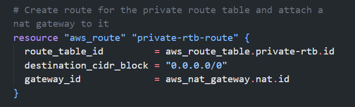

- We need to associate all the private subnets to the private route table.
```terraform
# associate all private subnets with the private route table
resource "aws_route_table_association" "private-subnets-assoc" {
  count          = length(aws_subnet.private[*].id)
  subnet_id      = element(aws_subnet.private[*].id, count.index)
  route_table_id = aws_route_table.private-rtb.id
}
```

result:
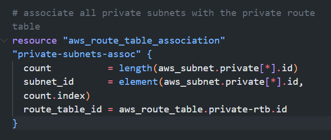

#### Creating Public routes
Now let's move on to creating our public routes which would then be associated to the internet gateway and then associate our public subnets to the public route table.

- Add the following line to `routes.tf` to create the public route table
```terraform
resource "aws_route_table" "public-rtb" {
  vpc_id = aws_vpc.main.id

  tags = merge(
    var.tags,
    {
      Name = format("%s-PublicRoute-Table-%s", var.name, var.environment)
    },
  )
}
```

result:
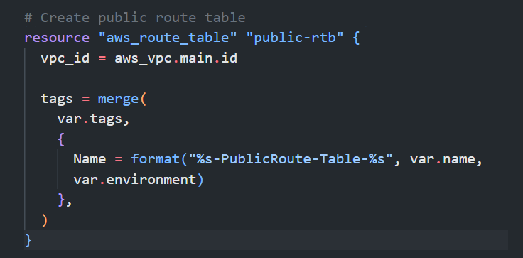

- Let's now create the public route table and attach an internet gateway to it.
```terraform
# Create route for the public route table and attach a internet gateway to it
resource "aws_route" "public-rtb-route" {
  route_table_id         = aws_route_table.public-rtb.id
  destination_cidr_block = "0.0.0.0/0"
  gateway_id             = aws_internet_gateway.ig.id
}
```

result:
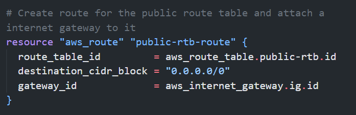

- Let's now associate our public subnets with the public route table.
```terraform
# associate all public subnets with the public route table
resource "aws_route_table_association" "public-subnets-assoc" {
  count          = length(aws_subnet.public[*].id)
  subnet_id      = element(aws_subnet.public[*].id, count.index)
  route_table_id = aws_route_table.public-rtb.id
}
```

result:
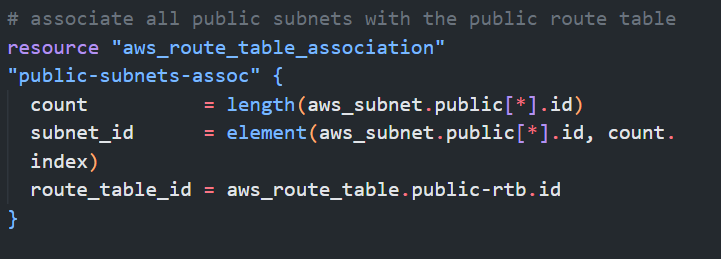

- Let's run `terraform plan` to see the changes that would be made
```bash
terraform validate
terraform plan
```

result:
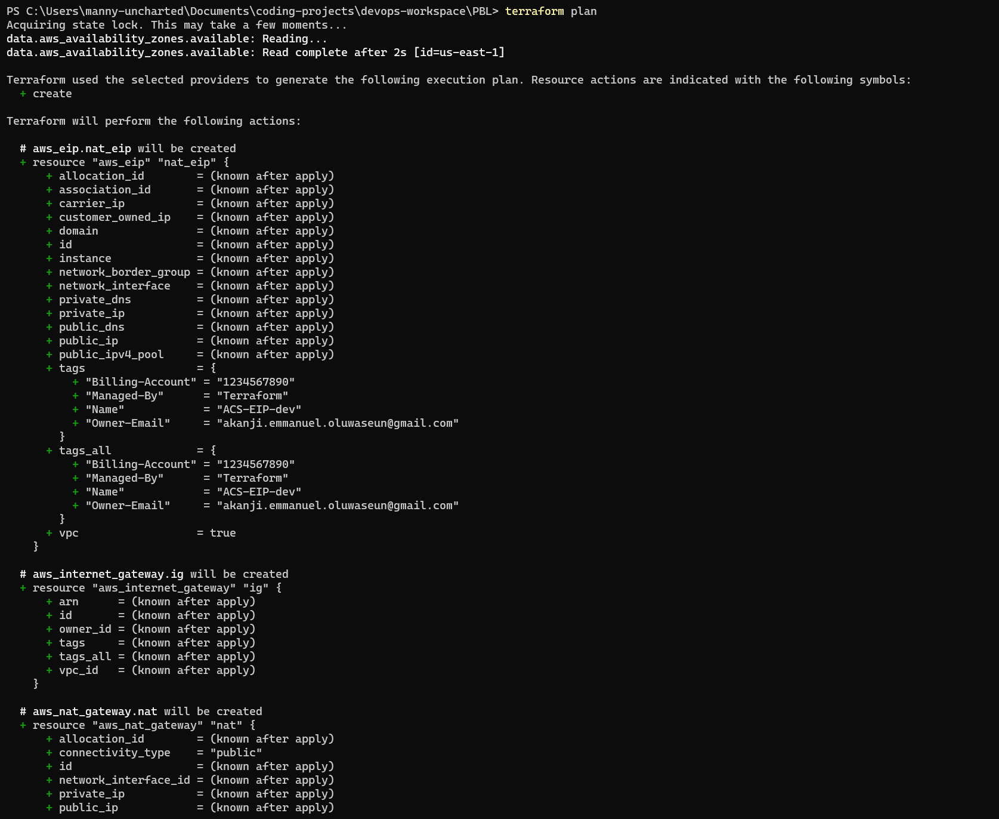

- Let's now run `terraform apply` to apply the changes
```bash
terraform apply --auto-approve
```

result:
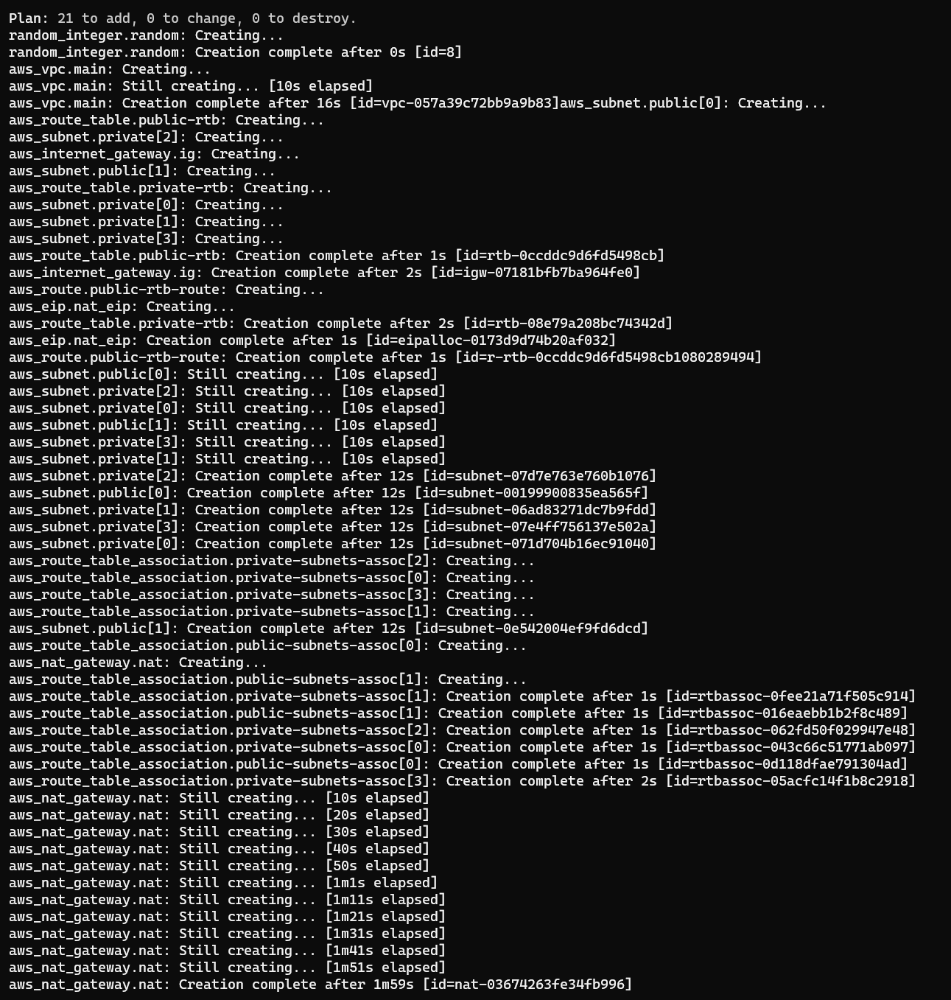


## AWS Identity and Access Management
We want to pass an IAM role on our EC2 instances to give them access to some specific resources, so we need to do the following:

### Creating an IAM role (AssumeRole)
Assume Role uses Security Token Service (STS) API that returns a set of temporary security credentials that you can use to access AWS resources that you might not normally have access to. These temporary credentials consist of an access key ID, a secret access key, and a security token. Typically, you use AssumeRole within your account or for cross-account access.

- Let's create a file called `roles.tf` and add the following to it to create an IAM role
```terraform
resource "aws_iam_role" "ec2_instance_role" {
name = "ec2_instance_role"
  assume_role_policy = jsonencode({
    Version = "2012-10-17"
    Statement = [
      {
        Action = "sts:AssumeRole"
        Effect = "Allow"
        Sid    = ""
        Principal = {
          Service = "ec2.amazonaws.com"
        }
      },
    ]
  })

  tags = merge(
    var.tags,
    {
      Name = "aws assume role"
    },
  )
}
```
Note: This role grants an entity which is ec2, the ability to assume the role.

result:
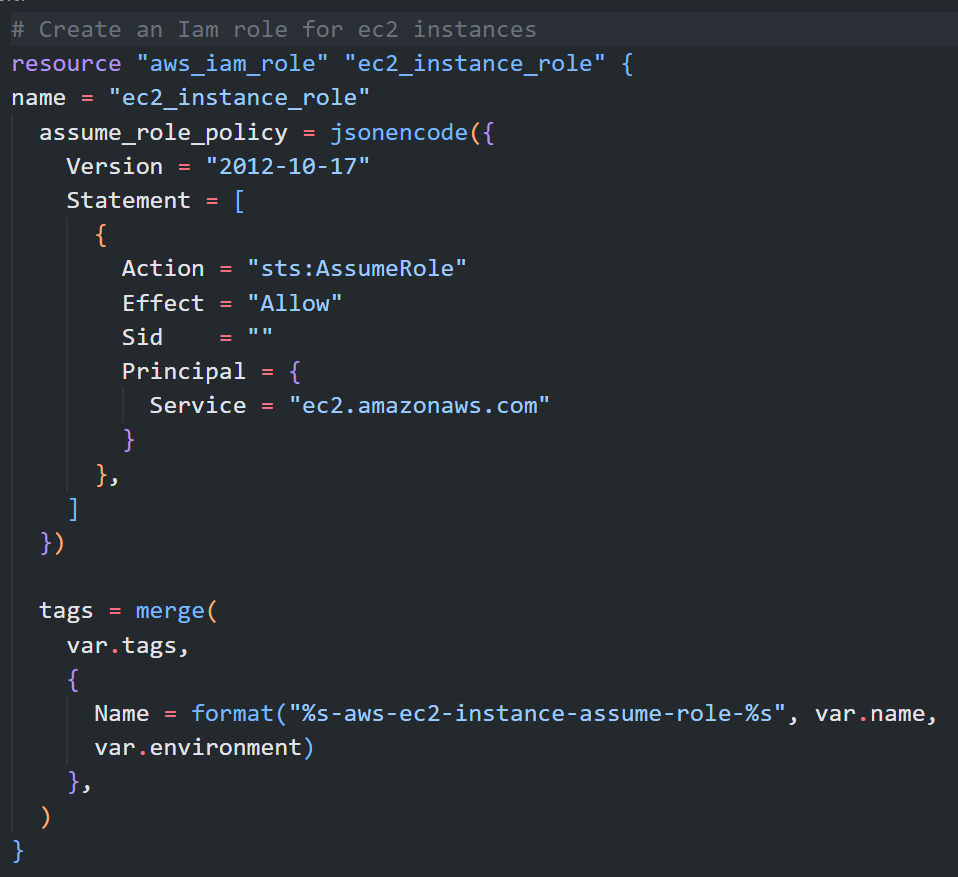


### Creating an IAM policy
- This is where we need to define a required policy (i.e., permissions) according to our requirements. For example, allowing an IAM role to perform the action `describe` applied to EC2 instances:
```terraform
resource "aws_iam_policy" "policy" {
  name        = "ec2_instance_policy"
  description = "A test policy"
  policy = jsonencode({
    Version = "2012-10-17"
    Statement = [
      {
        Action = [
          "ec2:Describe*",
        ]
        Effect   = "Allow"
        Resource = "*"
      },
    ]

  })

  tags = merge(
    var.tags,
    {
      Name =  "aws assume policy"
    },
  )

}
```

result:
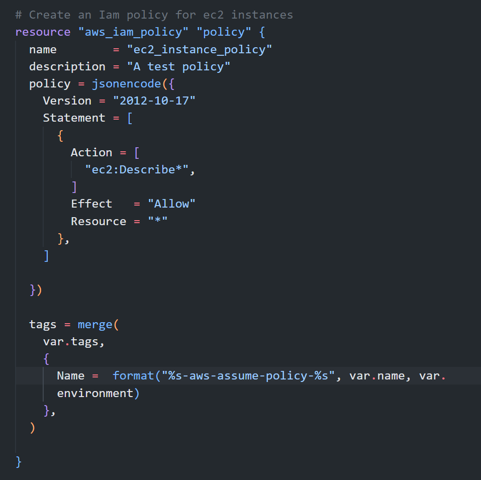

- Let's attach the Policy to the IAM Role. We can do this by adding the following to `roles.tf`
```terraform
resource "aws_iam_role_policy_attachment" "test-attach" {
        role       = aws_iam_role.ec2_instance_role.name
        policy_arn = aws_iam_policy.policy.arn
    }
```

result:
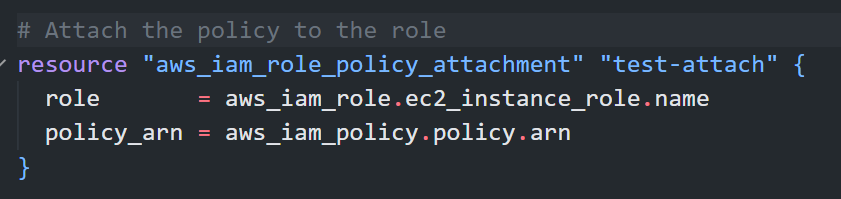

- Let's create an instance profile and interpolate the `IAM Role` to it. We can do this by adding the following to `roles.tf`
```terraform
resource "aws_iam_instance_profile" "ip" {
        name = "aws_instance_profile_test"
        role =  aws_iam_role.ec2_instance_role.name
    }
```

**Note:** An instance profile is a container for an IAM role that you can use to pass role information to an Amazon EC2 instance when the instance starts.

result:
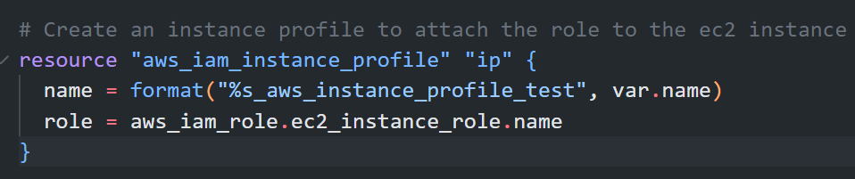