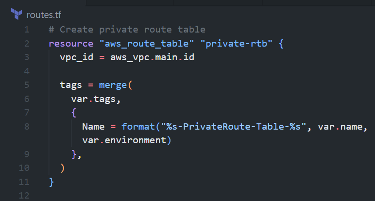
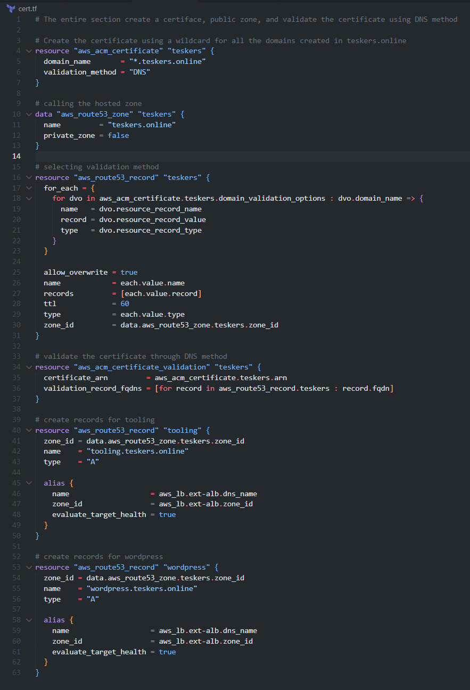

# AUTOMATE INFRASTRUCTURE WITH IAC USING TERRAFORM PART 2

## Table of Contents
- [Introduction](#introduction)
- [Prerequisites](#prerequisites)
- [Networking](#networking)
    - [Creating our Private Subnets](#creating-our-private-subnets)
    - [Introducing Tagging](#introducing-tagging)
    - [Creating our Internet Gateway](#creating-our-internet-gateway)
    - [Creating our NAT Gateway](#creating-our-nat-gateway)
    - [AWS Routes](#aws-routes) 
        - [Creating Private routes](#creating-private-routes)
        - [Creating Public routes](#creating-public-routes)
- [AWS Identity and Access Management](#aws-identity-and-access-management)
    - [Creating an IAM Role (AssumeRole)](#creating-an-iam-role-assumerole)
    - [Creating an IAM Policy](#creating-an-iam-policy)
- [CREATE SECURITY GROUPS](#create-security-groups)
- [Create a Certificate from Amazon Certificate Manager](#create-a-certificate-from-amazon-certificate-manager)
- [Create an external (Internet facing) Application Load Balancer (ALB)](#create-an-external-internet-facing-application-load-balancer-alb)
- [CREATING AUTOSCALING GROUPS](#creating-autoscaling-groups)
- [Creating notifications for all the auto-scaling groups](#creating-notifications-for-all-the-auto-scaling-groups)
- [Creating our Launch Templates](#creating-our-launch-templates)

## Introduction
This is the second part of the series on Infrastructure as Code using Terraform. In this part, we will be creating a VPC, Subnets, Internet Gateway, NAT gateway, Route Table, AutoScaling group, RDS, Security Group and EC2 instance. We will also be using the outputs from the previous part to create the VPC and Subnets.
To get up to speed with the previous part, you can read it [here](https://github.com/manny-uncharted/project-16)

Note: We are building according to this architecture


## Prerequisites
- [Terraform](https://www.terraform.io/downloads.html)
- [AWS Account](https://aws.amazon.com/)
- [AWS CLI](https://docs.aws.amazon.com/cli/latest/userguide/cli-chap-install.html)


## Networking
As a continuation to our previous part we would get started by

- Initializing Terraform
    ```bash
    terraform init
    ```

    result
    

### Creating our Private Subnets
We would need to create 4 private subnets in our VPC. 
- In the `main.tf` file, we would create a resource for the private subnets
```terraform
resource "aws_subnet" "private" {
  count                   = var.preferred_number_of_private_subnets == null ? length(data.aws_availability_zones.available.names) : var.preferred_number_of_public_subnets
  vpc_id                  = aws_vpc.main.id
  cidr_block              = cidrsubnet(var.vpc_cidr, 8, count.index + 2)
  map_public_ip_on_launch = true
  availability_zone       = data.aws_availability_zones.available.names[count.index]
}
```
- In our `variables.tf` file, we would add the following variables
```terraform
variable "preferred_number_of_private_subnets" {
  # default = 4
  type        = number
  description = "Number of private subnets to create. If not specified, all available AZs will be used."
}
```

- In our 'terraform.tfvars' file, we would add the following
```terraform
preferred_number_of_private_subnets = 4
```

- We would then run `terraform plan` to see the changes that would be made
```bash
terraform plan
```

result:


### Introducing Tagging
We would need to tag our resources to make it easier to identify them. 

- We would need to add the following to our `main.tf` file to the public and private subnets
```terraform
tags = merge(
    var.tags,
    {
      Name = format("%s-Private-subnet-%s", var.name, count.index + 1)
    },
)
```

- In our `variables.tf` file, we would add the following variables
```terraform
variable "tags" {
  type        = map(string)
  description = "A map of tags to add to all resources."
  default     = {}
}
```

Note: The `merge` function is used to merge two maps together. In this case, we are merging the `var.tags` and the `Name` tag. The `var.tags` is a map of tags that we would pass in as a variable. The `Name` tag is the name of the subnet. The 'format' function is used to format the string. In this case, we are formatting the string to include our defined name, the type of subnet and the index of the subnet.

result:


- Let's run 'terraform plan' to see the changes that would be made
```bash
terraform plan
```

result:


### Creating our Internet Gateway
We would need to create an internet gateway to allow our instances to access the internet.
- Create an internet gateway in a separate file called `internet_gateway.tf`
```terraform
resource "aws_internet_gateway" "ig" {
  vpc_id = aws_vpc.main.id

  tags = merge(
    var.tags,
    {
      Name = format("%s-Internet-Gateway", aws_vpc.main.id, "Internet-Gateway")
    },
  )
}
```

result:


- Run `terraform plan` to see the changes that would be made
```bash
terraform plan
```

result:


### Creating our NAT Gateways
We would need to create a NAT gateway to allow our instances to access the internet without exposing them to the public internet. For the NAT gateway, we would need an elastic IP address.

- Create an elastic IP address in a separate file called `nat_gateway.tf`
```terraform
resource "aws_eip" "nat_eip" {
  vpc        = true
  depends_on = [aws_internet_gateway.ig]

  tags = merge(
    var.tags,
    {
      Name = format("%s-EIP-%s", var.name, var.environment)
    },
  )
}
```
Note: The `depends_on` is used to ensure that the elastic IP address is created after the internet gateway is created. This ensures that the elastic IP address does not get created before the internet gateway.

result:


- Let's now move on to creating the NAT gateway
```terraform
resource "aws_nat_gateway" "nat" {
  allocation_id = aws_eip.nat_eip.id
  subnet_id     = element(aws_subnet.public.*.id, 0)
  depends_on    = [aws_internet_gateway.ig]

  tags = merge(
    var.tags,
    {
      Name = format("%s-Nat-%s", var.name, var.environment)
    },
  )
}
```

Note: Don't forget to declare the variable `environment` in the `variables.tf` file. As this would help us identify the environment we are deploying to.

```terraform
variable "environment" {
  type        = string
  description = "The environment we are deploying to."
  default     = "dev"
}
```

result:


- Let's run `terraform plan` to see the changes that would be made
```bash
terraform validate
terraform plan
```

Note: The `terraform validate` command is used to validate the syntax of the terraform files. It is a good practice to run this command before running `terraform plan` to ensure that there are no syntax errors in the terraform files.

result:


### AWS Routes
We need to create two route tables for our VPC. One for the public subnets and the other for the private subnets. For the private subnets, we would add the NAT gateway as that would stand as our gateway for the private subnets. For the public subnets, we would add the internet gateway as that would stand as our gateway for the public subnets. We would be doing the following:
- Creating the private routes
- Creating the public routes


#### Creating Private routes
- Create a file called `routes.tf` and add the following to it to create the private route table
```terraform
resource "aws_route_table" "private-rtb" {
  vpc_id = aws_vpc.main.id

  tags = merge(
    var.tags,
    {
      Name = format("%s-PrivateRoute-Table-%s", var.name, var.environment)
    },
  )
}
```

result:


- Let's now create the private route table and attach a nat gateway to it.
```terraform
# Create route for the private route table and attach a nat gateway to it
resource "aws_route" "private-rtb-route" {
  route_table_id         = aws_route_table.private-rtb.id
  destination_cidr_block = "0.0.0.0/0"
  gateway_id             = aws_nat_gateway.nat.id
}
```

result:


- We need to associate all the private subnets to the private route table.
```terraform
# associate all private subnets with the private route table
resource "aws_route_table_association" "private-subnets-assoc" {
  count          = length(aws_subnet.private[*].id)
  subnet_id      = element(aws_subnet.private[*].id, count.index)
  route_table_id = aws_route_table.private-rtb.id
}
```

result:


#### Creating Public routes
Now let's move on to creating our public routes which would then be associated to the internet gateway and then associate our public subnets to the public route table.

- Add the following line to `routes.tf` to create the public route table
```terraform
resource "aws_route_table" "public-rtb" {
  vpc_id = aws_vpc.main.id

  tags = merge(
    var.tags,
    {
      Name = format("%s-PublicRoute-Table-%s", var.name, var.environment)
    },
  )
}
```

result:


- Let's now create the public route table and attach an internet gateway to it.
```terraform
# Create route for the public route table and attach a internet gateway to it
resource "aws_route" "public-rtb-route" {
  route_table_id         = aws_route_table.public-rtb.id
  destination_cidr_block = "0.0.0.0/0"
  gateway_id             = aws_internet_gateway.ig.id
}
```

result:


- Let's now associate our public subnets with the public route table.
```terraform
# associate all public subnets with the public route table
resource "aws_route_table_association" "public-subnets-assoc" {
  count          = length(aws_subnet.public[*].id)
  subnet_id      = element(aws_subnet.public[*].id, count.index)
  route_table_id = aws_route_table.public-rtb.id
}
```

result:


- Let's run `terraform plan` to see the changes that would be made
```bash
terraform validate
terraform plan
```

result:


- Let's now run `terraform apply` to apply the changes
```bash
terraform apply --auto-approve
```

result:


## AWS Identity and Access Management
We want to pass an IAM role on our EC2 instances to give them access to some specific resources, so we need to do the following:

### Creating an IAM role (AssumeRole)
Assume Role uses Security Token Service (STS) API that returns a set of temporary security credentials that you can use to access AWS resources that you might not normally have access to. These temporary credentials consist of an access key ID, a secret access key, and a security token. Typically, you use AssumeRole within your account or for cross-account access.

- Let's create a file called `roles.tf` and add the following to it to create an IAM role
```terraform
resource "aws_iam_role" "ec2_instance_role" {
name = "ec2_instance_role"
  assume_role_policy = jsonencode({
    Version = "2012-10-17"
    Statement = [
      {
        Action = "sts:AssumeRole"
        Effect = "Allow"
        Sid    = ""
        Principal = {
          Service = "ec2.amazonaws.com"
        }
      },
    ]
  })

  tags = merge(
    var.tags,
    {
      Name = "aws assume role"
    },
  )
}
```
Note: This role grants an entity which is ec2, the ability to assume the role.

result:


### Creating an IAM policy
- This is where we need to define a required policy (i.e., permissions) according to our requirements. For example, allowing an IAM role to perform the action `describe` applied to EC2 instances:
```terraform
resource "aws_iam_policy" "policy" {
  name        = "ec2_instance_policy"
  description = "A test policy"
  policy = jsonencode({
    Version = "2012-10-17"
    Statement = [
      {
        Action = [
          "ec2:Describe*",
        ]
        Effect   = "Allow"
        Resource = "*"
      },
    ]

  })

  tags = merge(
    var.tags,
    {
      Name =  "aws assume policy"
    },
  )

}
```

result:


- Let's attach the Policy to the IAM Role. We can do this by adding the following to `roles.tf`
```terraform
resource "aws_iam_role_policy_attachment" "test-attach" {
        role       = aws_iam_role.ec2_instance_role.name
        policy_arn = aws_iam_policy.policy.arn
    }
```

result:


- Let's create an instance profile and interpolate the `IAM Role` to it. We can do this by adding the following to `roles.tf`
```terraform
resource "aws_iam_instance_profile" "ip" {
        name = "aws_instance_profile_test"
        role =  aws_iam_role.ec2_instance_role.name
    }
```

**Note:** An instance profile is a container for an IAM role that you can use to pass role information to an Amazon EC2 instance when the instance starts.

result:


We are pretty much done with Identity and Management part for now, let us move on and create other resources required.


## CREATE SECURITY GROUPS
Security groups are stateful, which means that if you allow inbound traffic to a resource, the same outbound traffic is automatically allowed, and vice versa. For example, if you allow inbound HTTP traffic, any outbound HTTP traffic is automatically allowed, and vice versa.
We are going to create all the security groups in a single file, then we are going to reference this security group within each resource that needs it.

- Create a file called security.tf and add the following to it:
```terraform
# security group for alb, to allow acess from any where for HTTP and HTTPS traffic
resource "aws_security_group" "ext-alb-sg" {
  name        = "ext-alb-sg"
  vpc_id      = aws_vpc.main.id
  description = "Allow TLS inbound traffic"

  ingress {
    description = "HTTP"
    from_port   = 80
    to_port     = 80
    protocol    = "tcp"
    cidr_blocks = ["0.0.0.0/0"]
  }

  ingress {
    description = "HTTPS"
    from_port   = 22
    to_port     = 22
    protocol    = "tcp"
    cidr_blocks = ["0.0.0.0/0"]
  }

  egress {
    from_port   = 0
    to_port     = 0
    protocol    = "-1"
    cidr_blocks = ["0.0.0.0/0"]
  }

 tags = merge(
    var.tags,
    {
      Name = "ext-alb-sg"
    },
  )

}

# security group for bastion, to allow access into the bastion host from you IP
resource "aws_security_group" "bastion_sg" {
  name        = "vpc_web_sg"
  vpc_id = aws_vpc.main.id
  description = "Allow incoming HTTP connections."

  ingress {
    description = "SSH"
    from_port   = 22
    to_port     = 22
    protocol    = "tcp"
    cidr_blocks = ["0.0.0.0/0"]
  }

  egress {
    from_port   = 0
    to_port     = 0
    protocol    = "-1"
    cidr_blocks = ["0.0.0.0/0"]
  }

   tags = merge(
    var.tags,
    {
      Name = "Bastion-SG"
    },
  )
}

#security group for nginx reverse proxy, to allow access only from the extaernal load balancer and bastion instance
resource "aws_security_group" "nginx-sg" {
  name   = "nginx-sg"
  vpc_id = aws_vpc.main.id

  egress {
    from_port   = 0
    to_port     = 0
    protocol    = "-1"
    cidr_blocks = ["0.0.0.0/0"]
  }

   tags = merge(
    var.tags,
    {
      Name = "nginx-SG"
    },
  )
}

resource "aws_security_group_rule" "inbound-nginx-http" {
  type                     = "ingress"
  from_port                = 443
  to_port                  = 443
  protocol                 = "tcp"
  source_security_group_id = aws_security_group.ext-alb-sg.id
  security_group_id        = aws_security_group.nginx-sg.id
}

resource "aws_security_group_rule" "inbound-bastion-ssh" {
  type                     = "ingress"
  from_port                = 22
  to_port                  = 22
  protocol                 = "tcp"
  source_security_group_id = aws_security_group.bastion_sg.id
  security_group_id        = aws_security_group.nginx-sg.id
}

# security group for ialb, to have acces only from nginx reverser proxy server
resource "aws_security_group" "int-alb-sg" {
  name   = "my-alb-sg"
  vpc_id = aws_vpc.main.id

  egress {
    from_port   = 0
    to_port     = 0
    protocol    = "-1"
    cidr_blocks = ["0.0.0.0/0"]
  }

  tags = merge(
    var.tags,
    {
      Name = "int-alb-sg"
    },
  )

}

resource "aws_security_group_rule" "inbound-ialb-https" {
  type                     = "ingress"
  from_port                = 443
  to_port                  = 443
  protocol                 = "tcp"
  source_security_group_id = aws_security_group.nginx-sg.id
  security_group_id        = aws_security_group.int-alb-sg.id
}

# security group for webservers, to have access only from the internal load balancer and bastion instance
resource "aws_security_group" "webserver-sg" {
  name   = "my-asg-sg"
  vpc_id = aws_vpc.main.id

  egress {
    from_port   = 0
    to_port     = 0
    protocol    = "-1"
    cidr_blocks = ["0.0.0.0/0"]
  }

  tags = merge(
    var.tags,
    {
      Name = "webserver-sg"
    },
  )

}

resource "aws_security_group_rule" "inbound-web-https" {
  type                     = "ingress"
  from_port                = 443
  to_port                  = 443
  protocol                 = "tcp"
  source_security_group_id = aws_security_group.int-alb-sg.id
  security_group_id        = aws_security_group.webserver-sg.id
}

resource "aws_security_group_rule" "inbound-web-ssh" {
  type                     = "ingress"
  from_port                = 22
  to_port                  = 22
  protocol                 = "tcp"
  source_security_group_id = aws_security_group.bastion_sg.id
  security_group_id        = aws_security_group.webserver-sg.id
}

# security group for datalayer to alow traffic from websever on nfs and mysql port and bastiopn host on mysql port
resource "aws_security_group" "datalayer-sg" {
  name   = "datalayer-sg"
  vpc_id = aws_vpc.main.id

  egress {
    from_port   = 0
    to_port     = 0
    protocol    = "-1"
    cidr_blocks = ["0.0.0.0/0"]
  }

 tags = merge(
    var.tags,
    {
      Name = "datalayer-sg"
    },
  )
}

resource "aws_security_group_rule" "inbound-nfs-port" {
  type                     = "ingress"
  from_port                = 2049
  to_port                  = 2049
  protocol                 = "tcp"
  source_security_group_id = aws_security_group.webserver-sg.id
  security_group_id        = aws_security_group.datalayer-sg.id
}

resource "aws_security_group_rule" "inbound-mysql-bastion" {
  type                     = "ingress"
  from_port                = 3306
  to_port                  = 3306
  protocol                 = "tcp"
  source_security_group_id = aws_security_group.bastion_sg.id
  security_group_id        = aws_security_group.datalayer-sg.id
}

resource "aws_security_group_rule" "inbound-mysql-webserver" {
  type                     = "ingress"
  from_port                = 3306
  to_port                  = 3306
  protocol                 = "tcp"
  source_security_group_id = aws_security_group.webserver-sg.id
  security_group_id        = aws_security_group.datalayer-sg.id
}
```

**Note:** The `aws_security_group_rule` resources are used to allow traffic between security groups.

result:


## Create a Certificate from Amazon Certificate Manager
- Create `cert.tf` file and add the following code snippets to it.
```terraform
# The entire section create a certiface, public zone, and validate the certificate using DNS method

# Create the certificate using a wildcard for all the domains created in teskers.online
resource "aws_acm_certificate" "teskers" {
  domain_name       = "*.teskers.online"
  validation_method = "DNS"
}

# calling the hosted zone
data "aws_route53_zone" "teskers" {
  name         = "teskers.online"
  private_zone = false
}

# selecting validation method
resource "aws_route53_record" "teskers" {
  for_each = {
    for dvo in aws_acm_certificate.teskers.domain_validation_options : dvo.domain_name => {
      name   = dvo.resource_record_name
      record = dvo.resource_record_value
      type   = dvo.resource_record_type
    }
  }

  allow_overwrite = true
  name            = each.value.name
  records         = [each.value.record]
  ttl             = 60
  type            = each.value.type
  zone_id         = data.aws_route53_zone.teskers.zone_id
}

# validate the certificate through DNS method
resource "aws_acm_certificate_validation" "teskers" {
  certificate_arn         = aws_acm_certificate.teskers.arn
  validation_record_fqdns = [for record in aws_route53_record.teskers : record.fqdn]
}

# create records for tooling
resource "aws_route53_record" "tooling" {
  zone_id = data.aws_route53_zone.teskers.zone_id
  name    = "tooling.teskers.online"
  type    = "A"

  alias {
    name                   = aws_lb.ext-alb.dns_name
    zone_id                = aws_lb.ext-alb.zone_id
    evaluate_target_health = true
  }
}

# create records for wordpress
resource "aws_route53_record" "wordpress" {
  zone_id = data.aws_route53_zone.teskers.zone_id
  name    = "wordpress.teskers.online"
  type    = "A"

  alias {
    name                   = aws_lb.ext-alb.dns_name
    zone_id                = aws_lb.ext-alb.zone_id
    evaluate_target_health = true
  }
}
```

result:



## Create an external (Internet facing) Application Load Balancer (ALB)

First of all, we will create the ALB, then we create the target group and lastly we will create the listener rule.

- We need to create an ALB to balance the traffic between the instances. Create a file called alb.tf and add the following code snippets to it.
```terraform
# Create external application load balancer.
resource "aws_lb" "ext-alb" {
  name     = "ext-alb"
  internal = false
  security_groups = [
    aws_security_group.ext-alb-sg.id,
  ]

  subnets = [
    aws_subnet.public[0].id,
    aws_subnet.public[1].id
  ]

  tags = merge(
    var.tags,
    {
      Name = "ACS-ext-alb"
    },
  )

  ip_address_type    = "ipv4"
  load_balancer_type = "application"
}
```

result:


- To inform our ALB where to route the traffic we need to create a `target group` to point to its targets:
```terraform
# Create target group to point to its targets.
resource "aws_lb_target_group" "nginx_tg" {
  health_check {
    interval            = 10
    path                = "/healthstatus"
    protocol            = "HTTPS"
    timeout             = 5
    healthy_threshold   = 5
    unhealthy_threshold = 2
  }
  name        = format("%s-nginx-tg-%s", var.name, var.environment)
  port        = 443
  protocol    = "HTTPS"
  target_type = "instance"
  vpc_id      = aws_vpc.main.id
}
```

result:


- We need to create a listener rule to route the traffic to the target group.
```terraform
# Create listener to redirect traffic to the target group.
resource "aws_lb_listener" "nginx-listener" {
  load_balancer_arn = aws_lb.ext-alb.arn
  port              = 443
  protocol          = "HTTPS"
  certificate_arn   = aws_acm_certificate_validation.teskers.certificate_arn

  default_action {
    type             = "forward"
    target_group_arn = aws_lb_target_group.nginx-tg.arn
  }
}
```

result:


## Create an Internal (Internal) Application Load Balancer (ALB)
For the internal ALB, we will follow the same concepts as the external load balancer. This load balancer would be used to balance the traffic between the instances in the private subnet which is our webservers.

- Create an internal load balancer with this code snippet:
```terraform
resource "aws_lb" "int-alb" {
  name     = "ialb"
  internal = true
  security_groups = [
    aws_security_group.int-alb-sg.id,
  ]

  subnets = [
    aws_subnet.private[0].id,
    aws_subnet.private[1].id
  ]

  tags = merge(
    var.tags,
    {
      Name = format("%s-int-alb-%s", var.name, var.environment)
    },
  )

  ip_address_type    = "ipv4"
  load_balancer_type = "application"
}
```

result:


- To inform our ALB where to route the traffic we need to create a `target group` to point to its targets:
```terraform
# Create target group for wordpress
resource "aws_lb_target_group" "wordpress-tg" {
  health_check {
    interval            = 10
    path                = "/healthstatus"
    protocol            = "HTTPS"
    timeout             = 5
    healthy_threshold   = 5
    unhealthy_threshold = 2
  }

  name        = format("%s-wordpress-tg-%s", var.name, var.environment)
  port        = 443
  protocol    = "HTTPS"
  target_type = "instance"
  vpc_id      = aws_vpc.main.id
}

# --- target group for tooling -------

resource "aws_lb_target_group" "tooling-tg" {
  health_check {
    interval            = 10
    path                = "/healthstatus"
    protocol            = "HTTPS"
    timeout             = 5
    healthy_threshold   = 5
    unhealthy_threshold = 2
  }

  name        = format("%s-tooling-tg-%s", var.name, var.environment)
  port        = 443
  protocol    = "HTTPS"
  target_type = "instance"
  vpc_id      = aws_vpc.main.id
}
```

result:


- We need to create a listener rule to route the traffic to the target group.
```terraform
# For this aspect a single listener was created for the wordpress which is default,
# A rule was created to route traffic to tooling when the host header changes

resource "aws_lb_listener" "web-listener" {
  load_balancer_arn = aws_lb.int-alb.arn
  port              = 443
  protocol          = "HTTPS"
  certificate_arn   = aws_acm_certificate_validation.teskers.certificate_arn

  default_action {
    type             = "forward"
    target_group_arn = aws_lb_target_group.wordpress-tg.arn
  }
}

# listener rule for tooling target

resource "aws_lb_listener_rule" "tooling-listener" {
  listener_arn = aws_lb_listener.web-listener.arn
  priority     = 99

  action {
    type             = "forward"
    target_group_arn = aws_lb_target_group.tooling-tg.arn
  }

  condition {
    host_header {
      values = ["tooling.teskers.online"]
    }
  }
}
```

result:


- Now run `terraform plan` and `terraform apply` to create the load balancers.
```bash
terraform plan
terraform apply
```

result:


## CREATING AUTOSCALING GROUPS.

In this section, we will create the Auto Scaling Group (ASG) we need for the architecture. Our ASG needs to be able to scale the EC2s out and in depending on the application traffic.

Before we start configuring an ASG, we need to create the launch template and the AMI needed. For now, we are going to use a random AMI from AWS, then in project 19, we will use Packer to create our AMI.

Based on our architecture we need Auto Scaling Groups for bastion, `Nginx`, `wordpress` and `tooling`, so we will create two files; `asg-bastion-nginx.tf` will contain Launch Template and Austoscaling group for Bastion and Nginx, then `asg-wordpress-tooling.tf` will contain Launch Template and Autoscaling group for wordpress and tooling.

## Creating notifications for all the auto-scaling groups
- Create `asg-bastion-nginx.tf` file and add the following code snippet:
```terraform
## creating sns topic for all the auto scaling groups
resource "aws_sns_topic" "manny-sns" {
name = "Default_CloudWatch_Alarms_Topic"
}
```
result:


- Create notifications for all the auto-scaling groups
```terraform
resource "aws_autoscaling_notification" "david_notifications" {
  group_names = [
    aws_autoscaling_group.bastion-asg.name,
    aws_autoscaling_group.nginx-asg.name,
    aws_autoscaling_group.wordpress-asg.name,
    aws_autoscaling_group.tooling-asg.name,
  ]
  notifications = [
    "autoscaling:EC2_INSTANCE_LAUNCH",
    "autoscaling:EC2_INSTANCE_TERMINATE",
    "autoscaling:EC2_INSTANCE_LAUNCH_ERROR",
    "autoscaling:EC2_INSTANCE_TERMINATE_ERROR",
  ]

  topic_arn = aws_sns_topic.david-sns.arn
}
```

result:


## Creating our Launch Templates
- In our `asg-bastion-nginx.tf` file, we will create our launch templates for the bastion instance.
```terraform
# Get the list of availability zones
resource "random_shuffle" "az_list" {
  input        = data.aws_availability_zones.available.names
}


# Launch template for bastion hosts
resource "aws_launch_template" "bastion-launch-template" {
  image_id               = var.ami
  instance_type          = "t2.micro"
  vpc_security_group_ids = [aws_security_group.bastion_sg.id]

  iam_instance_profile {
    name = aws_iam_instance_profile.ip.id
  }

  key_name = var.keypair

  placement {
    availability_zone = "${random_shuffle.az_list.result}"
  }

  lifecycle {
    create_before_destroy = true
  }

  tag_specifications {
    resource_type = "instance"

   tags = merge(
    var.tags,
    {
      Name = format("%s-bastion-launch-template-%s", var.name, var.environment)
    },
  )
  }

  user_data = filebase64("${path.module}/bastion.sh")
}


# ---- Autoscaling for bastion  hosts
resource "aws_autoscaling_group" "bastion-asg" {
  name                      = "bastion-asg"
  max_size                  = 2
  min_size                  = 2
  health_check_grace_period = 300
  health_check_type         = "ELB"
  desired_capacity          = 2

  vpc_zone_identifier = [
    aws_subnet.public[0].id,
    aws_subnet.public[1].id
  ]

  launch_template {
    id      = aws_launch_template.bastion-launch-template.id
    version = "$Latest"
  }
  tag {
    key                 = "Name"
    value               = format("%s-bastion-asg-%s", var.name, var.environment)
    propagate_at_launch = true
  }

}


# launch template for nginx
resource "aws_launch_template" "nginx-launch-template" {
  image_id               = var.ami
  instance_type          = "t2.micro"
  vpc_security_group_ids = [aws_security_group.nginx-sg.id]

  iam_instance_profile {
    name = aws_iam_instance_profile.ip.id
  }

  key_name =  var.keypair

  placement {
    availability_zone = "random_shuffle.az_list.result"
  }

  lifecycle {
    create_before_destroy = true
  }

  tag_specifications {
    resource_type = "instance"

    tags = merge(
    var.tags,
    {
      Name = format("%s-nginx-launch-template-%s", var.name, var.environment)
    },
  )
  }

  user_data = filebase64("${path.module}/nginx.sh")
}

# ------ Autoscslaling group for reverse proxy nginx ---------

resource "aws_autoscaling_group" "nginx-asg" {
  name                      = "nginx-asg"
  max_size                  = 2
  min_size                  = 1
  health_check_grace_period = 300
  health_check_type         = "ELB"
  desired_capacity          = 1

  vpc_zone_identifier = [
    aws_subnet.public[0].id,
    aws_subnet.public[1].id
  ]

  launch_template {
    id      = aws_launch_template.nginx-launch-template.id
    version = "$Latest"
  }

  tag {
    key                 = "Name"
    value               = format("%s-nginx-asg-%s", var.name, var.environment)
    propagate_at_launch = true
  }

}

# attaching autoscaling group of nginx to external load balancer
resource "aws_autoscaling_attachment" "asg_attachment_nginx" {
  autoscaling_group_name = aws_autoscaling_group.nginx-asg.id
  alb_target_group_arn   = aws_lb_target_group.nginx-tg.arn
}
```

result:


